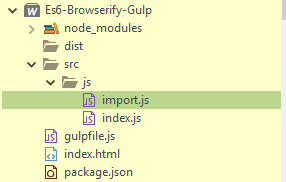
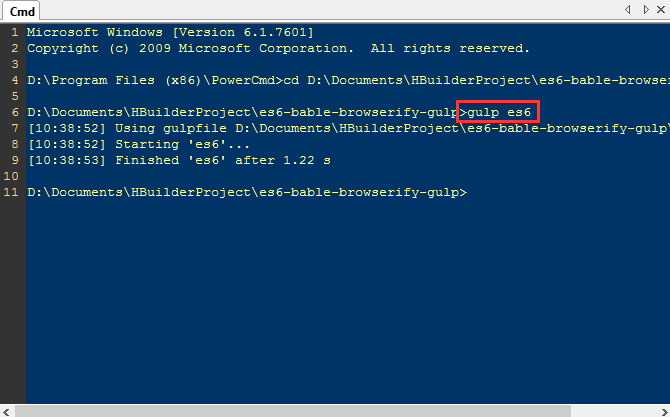
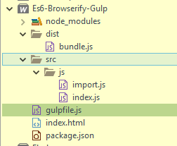
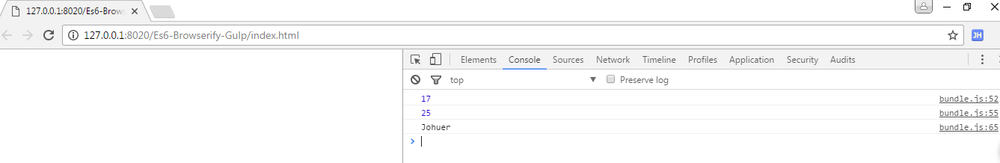

## 简介

### Browserify

[http://browserify.org/](http://browserify.org/)

> npm上有许多资源和第三方库，但是只能在node端使用，所以Browserify就是在浏览器端写node代码，然后转换为浏览器端使用。

Browsers don't have the require method defined, but Node.js does. With Browserify you can write code that uses require in the same way that you would use it in Node.

浏览器没有定义`require`方法，但是node.js有。使用`Browserify`能在浏览器端写代码使用`require`方法就同在`Node`上

<!--more-->

### ES6

[http://es6.ruanyifeng.com/](http://es6.ruanyifeng.com/)

> ECMAScript 6.0（以下简称ES6）是JavaScript语言的下一代标准，已经在2015年6月正式发布了。它的目标，是使得JavaScript语言可以用来编写复杂的大型应用程序，成为企业级开发语言。

### Gulp

[http://gulpjs.com/](http://gulpjs.com/)

> 用自动化构建工具增强你的工作流程！

## Browserify、Es6、Gulp关系

首先我们要使用ES6语法，但是现在浏览器支持不完全，所以需要使用Babel把ES6转换为ES5语法，Babel也可以用于浏览器环境。但是，从Babel 6.0开始，不再直接提供浏览器版本，而是要用构建工具构建出来，Gulp就是一款构建工具。

## Demo

> 创建Demo前，需先了解Browserify、ES6、Gulp的一些基本使用

### 工程目录

- `npm init -y` 初始化
- 创建 `gulpfile.js` 文件



### 编写js

import.js

```js
let sum = (a, b = 6) => (a + b);

let square = (b) => {
    return b * b;
};

let variable = 8;

class MyClass {
    constructor(credentials) {
        this.name = credentials.name;
        this.enrollmentNo = credentials.enrollmentNo
    }
    getName() {
        return this.name;
    }
}

export { sum, square, variable, MyClass };
```

index.js

```js
import {sum, square, variable, MyClass} from './import';

// 17
console.log(sum(10,7));

// 25
console.log(square(5));

let cred = {
    name: 'Johuer',
    age: 30
}

let x = new MyClass(cred);

//Johuer
console.log(x.getName());
```

### 编写gulp.js

```js
const gulp          = require( 'gulp' );
const browserify    = require( "browserify" );
const source        = require( 'vinyl-source-stream' );  
const babelify      = require( "babelify" );			//es6转es5

gulp.task('es6', function() {  
return browserify('./src/js/index.js')
    .transform(babelify, {
        presets: ["es2015"]
    })
    .bundle()
    .pipe(source('bundle.js')) // gives streaming vinyl file object
    .pipe(gulp.dest('dist'));
});
```

### npm下载全部依赖
```cmd
$ npm i --save-dev gulp
$ npm i --save-dev browserify
$ npm i --save-dev babelify
$ npm i --save-dev vinyl-source-stream
$ npm i --save-dev babel-preset-es2015
```

### 执行gulp命令

`gulp es6`





### 编写index.html

```html
<!DOCTYPE html>
<html>
	<head>
		<meta charset="utf-8" />
		<title></title>
	</head>
	<body>
	    <script src="dist/bundle.js" type="text/javascript" charset="utf-8"></script>
	</body>
</html>
```

### 浏览器运行



## Node模块加载

第一种方法
```js
import unique from 'uniq';
```

第二种方法
```js
var unique = require('uniq');
```

两种方法都可以使用。

index.js
```js
import {sum, square, variable, MyClass} from './import';	// 自定义

import unique from 'uniq'; //var unique = require('uniq');	// node模块
var data = [1, 2, 2, 3, 4, 5, 5, 5, 6];
console.log(unique(data));

// 17
console.log(sum(10,7));

// 25
console.log(square(5));

let cred = {
    name: 'Johuer',
    age: 30
}

let x = new MyClass(cred);

//Johuer
console.log(x.getName());
```

> 源码：[https://github.com/xujiuhua/Es6-Browserify-Gulp/](https://github.com/xujiuhua/Es6-Browserify-Gulp/)