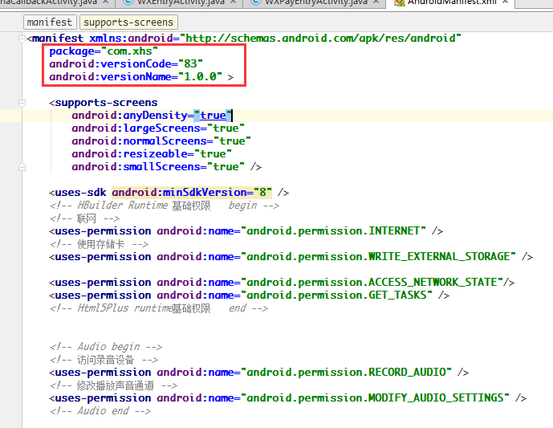

参照Hbuilder官方[Android离线打包](http://ask.dcloud.net.cn/article/38)，每次都要耗费不少时间，这里记录下自己实践的打包步骤。

[源码](https://github.com/xujiuhua/PackageDemo)

## Tool

- Android Studio
- Hbuilder

## 方法一

### 下载SDK项目

[SDK项目地址](http://ask.dcloud.net.cn/article/103)

解压后目录

<!--more-->

### Android Studio 导入`HBuilder-Hello`演示项目

不需要任何更改，导入后项目结构

### 运行项目

### 基于以上项目集成自己的Hbuilder项目

#### `assets\apps`下删除`HelloH5`

#### `assets\apps`新建目录

> 目录名称修改为应用manifest.json中的id名称（这步非常重要，否则会导致应用无法正常启动），并将所有应用资源拷贝到其下的www目录中

#### package结构

1. 新建包名就是Android包名，例如`com.xhs`

2. 复制`src\io\dcloud\HBuilder\Hello`下文件到`com.xhs`

3. 保留`src\io\dcloud\RInformation.java`，删除`src\io\dcloud`中其它文件

最终结构如下图

#### 修改`AndroidManifest.xml`

1. 全文替换(Ctrl+R) , `io.dcloud.HBuilder.Hello`替换为`com.xhs` (APP包名)
2. versionCode为应用的版本号（整数值），用于各应用市场的升级判断，建议与manifest.json中version -> code值一致；
3. versionName为应用的版本名称（字符串），在系统应用管理程序中显示的版本号，建议与manifest.json中version -> name值一致

#### 配置应用信息

打开assets -> data下的control.xml文件，修改appid值：

#### 配置`build.gradle`

> applicationId: app包名, 配置完同步一次

#### 启动工程

## 方法二

TODO