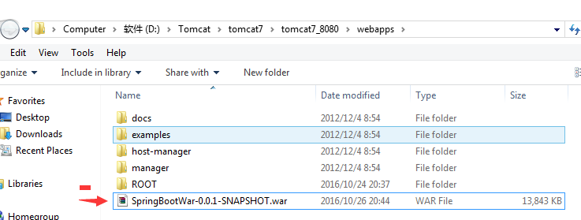

## 参看文档

[Create a deployable war file](http://docs.spring.io/spring-boot/docs/current-SNAPSHOT/reference/htmlsingle/#howto-traditional-deployment)

## 环境

 - JDK8、IDEA、SpringBoot、Gradle

<!--more-->

## 目录结构


## 步骤

### 主类继承 `SpringBootServletInitializer`

```java
package com.example;

import org.springframework.boot.SpringApplication;
import org.springframework.boot.autoconfigure.SpringBootApplication;
import org.springframework.boot.builder.SpringApplicationBuilder;
import org.springframework.boot.web.support.SpringBootServletInitializer;

@SpringBootApplication
public class SpringBootWarApplication extends SpringBootServletInitializer {

	@Override
	protected SpringApplicationBuilder configure(SpringApplicationBuilder application) {
		return application.sources(SpringBootWarApplication.class);
	}

	public static void main(String[] args) {
		SpringApplication.run(SpringBootWarApplication.class, args);
	}
}
```

controller

```java
package com.example.controller;

import org.springframework.stereotype.Controller;
import org.springframework.web.bind.annotation.RequestMapping;
import org.springframework.web.bind.annotation.ResponseBody;

import java.util.HashMap;
import java.util.Map;

/**
 * ${DESCRIPTION}
 *
 * @author xujiuhua
 * @create 2016-10-24-20:13
 */
@Controller
public class DemoController {

    @RequestMapping("demo1")
    @ResponseBody
    public Map<String, Object> demo1() {
        Map<String, Object> map = new HashMap<String, Object>();
        map.put("test", "demo1");
        return map;
    }
}
```

### 项目支持 `war`

编写`build.gradle`

> 注意两处war

```gradle
apply plugin: 'java'
apply plugin: 'eclipse'
apply plugin: 'spring-boot'
apply plugin: 'war'

war {
	baseName = 'SpringBootWar'
	version = '0.0.1-SNAPSHOT'
}
```

### 标记内置容器 `tomcat` 为 provided

```gradle
dependencies {
    // …
    providedRuntime 'org.springframework.boot:spring-boot-starter-tomcat'
    // …
}
```

### 执行 gradle 中 `build`


### 部署 `tomcat`

war包放入tomcat `webapp` 中




### 结果

> 请求地址需要加上项目解压后的项目名称:localhost:8080/SpringBootWar-0.0.1-SNAPSHOT/demo1,如果想部署根目录，直接把内容剪切到ROOT下


