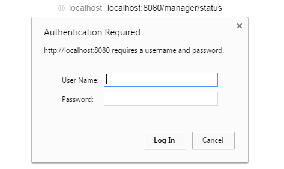
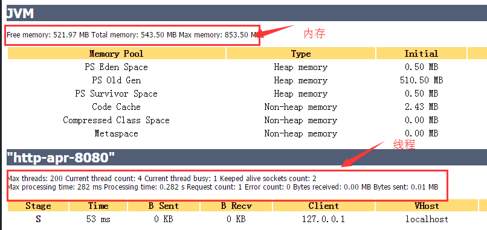

　　tomcat内存设置、线程池设置、及状态查看

## 内存设置
window：
修改文件：tomcat/bin/catalian.bat
在rem Guess CATALINA_HOME if not defined下添加：
`set JAVA_OPTS=-Xms512m -Xmx512m -XX:MaxNewSize=512m -XX:MaxPermSize=512m`

-Xms：java Heap初始大小。 默认是物理内存的1/64。
-Xmx：java heap最大值。建议均设为物理内存的一半。不可超过物理内存
-XX:PermSize:设定内存的永久保存区初始大小
-XX:MaxPermSize:设定内存的永久保存区最大大小
-XX:NewSize: 新生成的池的初始大小
-XX:MaxNewSize: 新生成的池的最大大小

<!--more-->

***

## 线程池设置
window:
修改文件：tomcat/config/server.xml
### 添加
在任意处添加节点
```xml
<Executor name="tomcatThreadPool" namePrefix="catalina-exec-"
    maxThreads="200" minSpareThreads="4"/>
```

### 修改
修改tomcat启动端口的节点Connector，插入`executor="tomcatThreadPool"`，tomcatThreadPool就是上面添加的节点
```xml
<Connector port="8080" protocol="HTTP/1.1"
               executor="tomcatThreadPool"
               connectionTimeout="20000"
               redirectPort="8443" />
```

***

## 查看配置信息
配置完信息后，如何查看是否生效

### 修改文件：
tomcat/config/tomcat-users.xml，添加节点
```xml
<role rolename="tomcat"/>
<role rolename="role1"/>
<role rolename="manager-script"/>
<user username="tomcat" password="tomcat" roles="tomcat"/>
<user username="both" password="tomcat" roles="tomcat,role1"/>
<user username="role1" password="tomcat" roles="role1"/>
<user username="admin" password="123456" roles="manager-script"/>
```
### 访问地址：
http://localhost:8080/manager/status

输入用户名/密码：及此节点roles="manager-script"对应username/password

登陆成功



